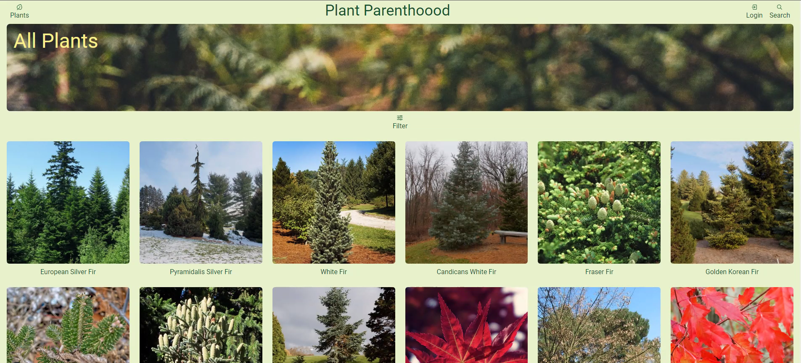
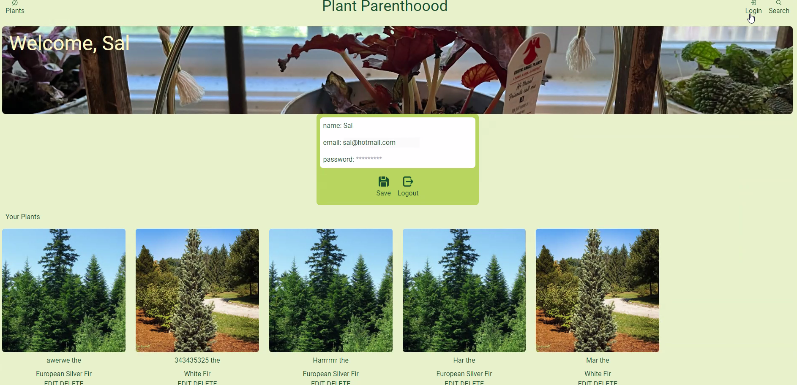
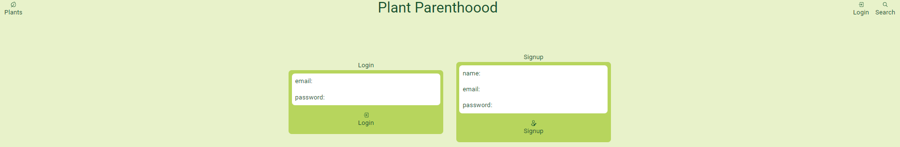
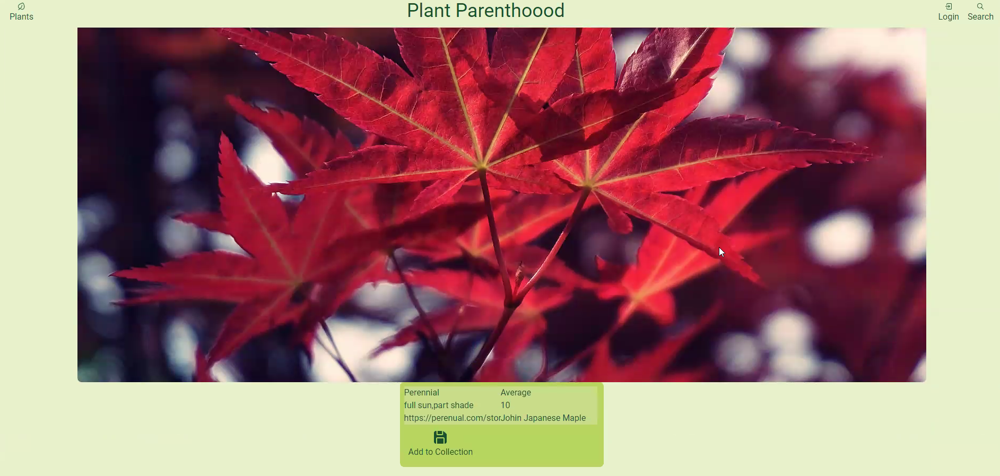

# Plant-Parenthood

# Description
A plant caretaking application for users to be able to compile and view information on the plants they own, ensuring they can take better care of their greenery.


## Goal
The goal of Plant-Parenthood is to help users take better care of their plants. Users can log in, enter the names of the plants they own, and view information about sunlight, water, and growth cycles for each plant. They can also add plants to their personal collection within their account.

## Technologies Used
In our plant care application, we utilized a variety of technologies to ensure a robust and interactive user experience. We built a RESTful API using Node.js and Express.js, allowing for efficient handling of data retrieval and submission. Handlebars.js served as our templating engine, enabling dynamic rendering of HTML content. For our database, we implemented PostgreSQL along with the Sequelize ORM, which facilitated seamless data management and interaction. Additionally, we deployed our project on GitHub and Render, ensuring reliable hosting and accessibility. Our UI is polished, responsive, and designed to interact intuitively with users, offering an engaging and informative experience on plant care. The plant information and images shown are sourced from the Perenual API. 

## Built With
[](https://github.com/Dylan-Thrasher/Plant-Parenthood/graphs/contributors)

Charles Gross was responsible for the UI and a majority of the code implementation. 
Dylan Thrasher contributed to backend code, refactoring original code, and segments of R&D. 
Ella Girin contributed to backend code, significant segments of R&D, along with updating additional necessary files. 

## Getting Started

Once completely built, this application will function as a deployed app on Render

### Local Installation / Testing

1. Clone the rep

```
git clone https://github.com/Dylan-Thrasher/Plant-Parenthood.git
```

2. Open your IDE's terminal and run the following command to install the app's external dependencies:

```
npm run i
```

3. Create the .env file and add your local information of DB_NAME, DB_PASSWORD, and DB_USER where user and password matches your psql login.

4. Run the following command in your SQL terminal:

```
DROP DATABASE IF EXISTS garden_db;
CREATE DATABASE garden_db;
```

5. Run the following command in your IDE's terminal to seed the database:

```
npm run seed
```

6. Run the following command in your IDE's terminal to run the app locally:

```
npm run start
```
## Usage

### Homepage


### Login/Signup




### Add to Collection



## Link to Deployed Application
GitHub: https://github.com/Dylan-Thrasher/Plant-Parenthood

Render: https://plant-parenthood-8msi.onrender.com


## License

This project is licensed under the MIT license.

See LICENSE.txt for more information.

## Github links for contributors

[Charles Gross](https://github.com/frenzie24)

[Dylan Thrasher](https://github.com/Dylan-Thrasher)

[Ella Girin](https://github.com/ellafsd)

## Acknowledgements

